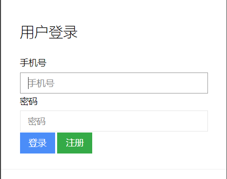
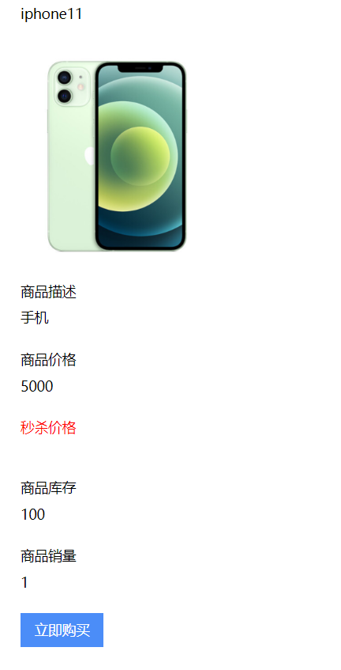

# miaosha

## 介绍
商城秒杀项目
### 登录
用户登录环节采取手机登录方式 由随机数进行模拟短信验证登录过程 验证码正确对注册界面对密码表以及用户表同时添加数据 
登陆成功将信息存储在session中(未考虑分布式环境)

### 交易
当下单时 要校验状态（用户登录以及商品是否存在问题）当下单时，实现对库存的减法操作以及商品销量的加操作 对多表进行操作要注意原子性 
订单id自定义其生成方式 对商品模块以及销售模块执行同步操作
